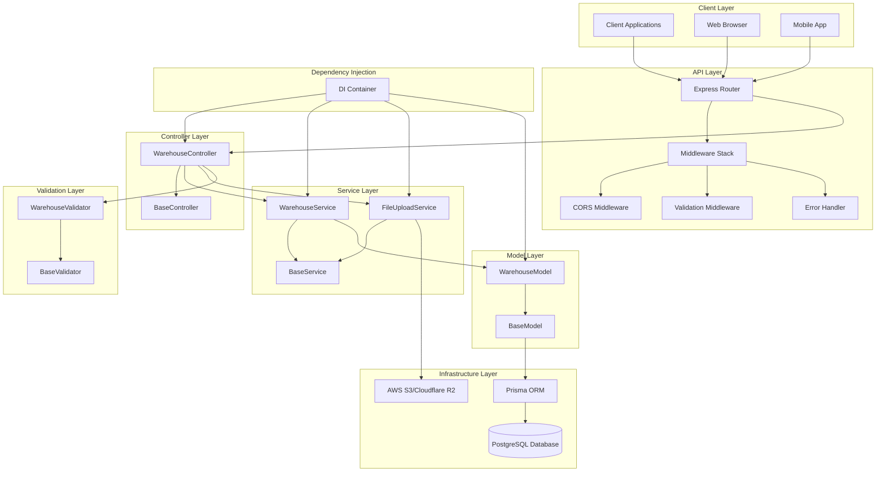
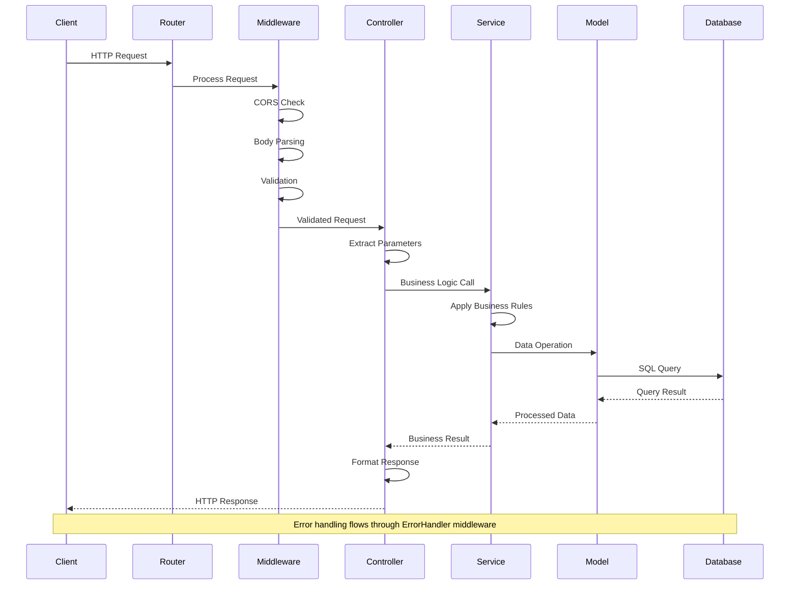
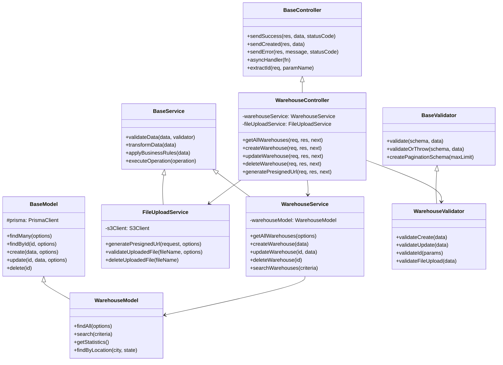
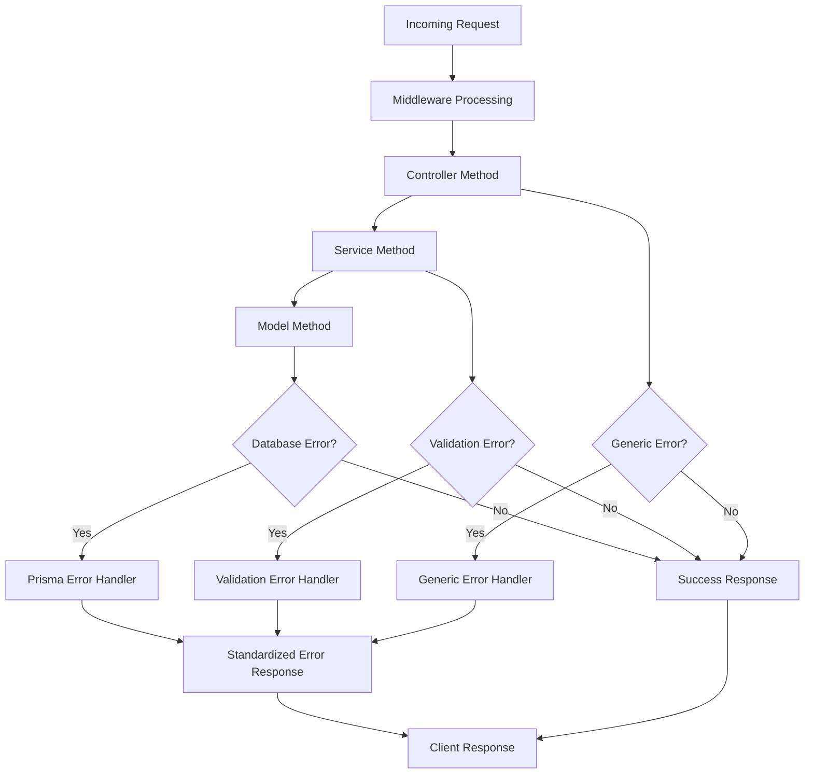
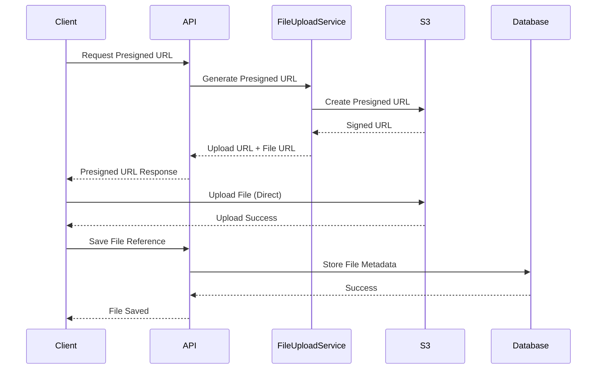
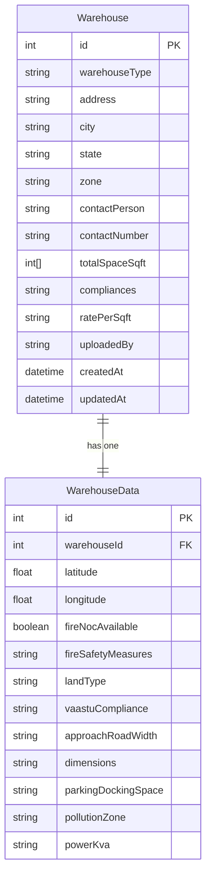
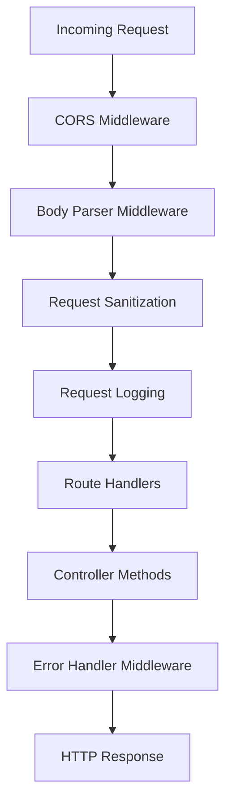

# Warehouse API Architecture Documentation

## Overview

This document provides detailed architectural diagrams and explanations for the Warehouse Management API, which follows a clean MVC (Model-View-Controller) pattern with dependency injection.

## System Architecture Diagram



## Request Flow Diagram



## Component Relationships



## Dependency Injection Pattern

```mermaid
graph LR
    subgraph "Container"
        Container[DI Container]
    end

    subgraph "Models"
        WM[WarehouseModel]
    end

    subgraph "Services"
        WS[WarehouseService]
        FUS[FileUploadService]
    end

    subgraph "Controllers"
        WC[WarehouseController]
    end

    Container -->|"resolve('warehouseModel')"| WM
    Container -->|"resolve('warehouseService')"| WS
    Container -->|"resolve('fileUploadService')"| FUS
    Container -->|"resolve('warehouseController')"| WC

    WS -->|"depends on"| WM
    WC -->|"depends on"| WS
    WC -->|"depends on"| FUS
```

## Error Handling Flow



## File Upload Architecture



## Database Schema Relationships



## Middleware Stack



## Key Architectural Principles

### 1. Separation of Concerns
- **Controllers**: Handle HTTP requests/responses only
- **Services**: Contain business logic and orchestration
- **Models**: Handle data persistence and database operations
- **Validators**: Manage input validation and sanitization

### 2. Dependency Injection
- Centralized dependency management through DI container
- Loose coupling between components
- Easy testing and mocking
- Singleton pattern for shared resources

### 3. Error Handling
- Centralized error handling middleware
- Consistent error response format
- Proper HTTP status codes
- Detailed logging for debugging

### 4. Validation Strategy
- Input validation at controller level
- Business rule validation at service level
- Database constraint validation at model level
- Consistent validation error format

### 5. File Upload Strategy
- Presigned URLs for direct client-to-S3 uploads
- Reduced server load and bandwidth
- Secure file upload with time-limited URLs
- File metadata tracking in database

## Performance Considerations

1. **Database Connection Pooling**: Single Prisma client instance
2. **Lazy Loading**: Load related data only when needed
3. **Caching Strategy**: Service-level caching for frequently accessed data
4. **Error Handling Optimization**: Minimal overhead in hot paths
5. **Memory Management**: Proper cleanup of resources and connections

## Security Features

1. **Input Validation**: All inputs validated at multiple levels
2. **SQL Injection Protection**: Prisma ORM provides built-in protection
3. **File Upload Security**: Content type and size validation
4. **Environment Variables**: Secure configuration management
5. **Error Information**: Sensitive data excluded from error responses
6. **CORS Configuration**: Configurable cross-origin policies

This architecture ensures maintainability, scalability, and security while following industry best practices for Node.js applications.